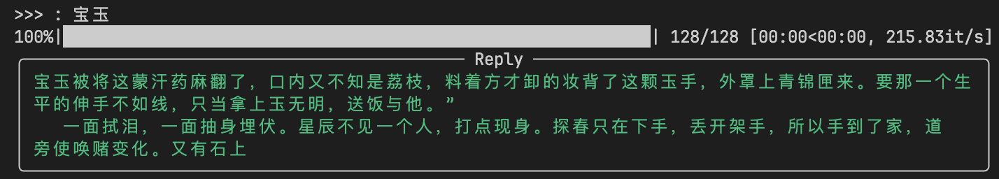
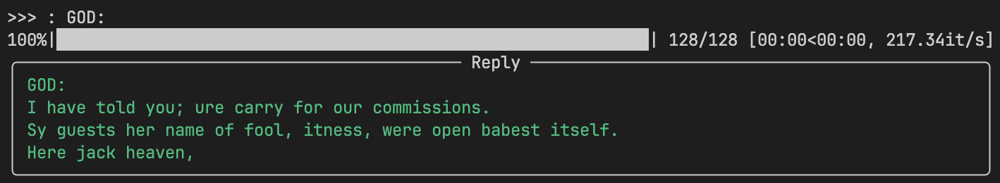

# TinyGPT

A tiny GPT model written in JAX.




Why jax? Because it's fast(after jit, before jit it's slow) and fun.

```shell
# create environment
conda create --name tinygpt python=3.11
conda activate tinygpt
conda install cuda -c nvidia
pip install "jax[cuda]" -f https://storage.googleapis.com/jax-releases/jax_cuda_releases.html
pip install flax optax tqdm fire --upgrade

# train and chat
python3 train.py --epochs 5000 --lr 1e-4 --batch_size 128 --block_size 128 --n_embd 512 --n_head 4 --n_layer 4
python3 chat.py
```

Training source in `data`:
```python
# english
'war-and-peace.txt',
'the-hunchback-of-notre-dame.txt',
'tiny-shakespeare.txt',
# chinese
'a-dream-of-red-mansions.txt',
'water-margin.txt',
'three-kingdoms.txt',
'the-journey-to-the-west.txt',
```

About 10 min training time in RTX 4090. Then you can chat with it.

## Reference
- [Let's build GPT: from scratch, in code, spelled out. - YouTube](https://www.youtube.com/watch?v=kCc8FmEb1nY)
- [bigeagle/picoGPT](https://github.com/bigeagle/picoGPT)

## License

MIT
